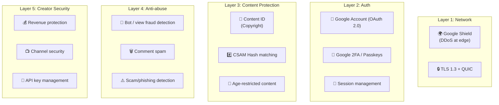
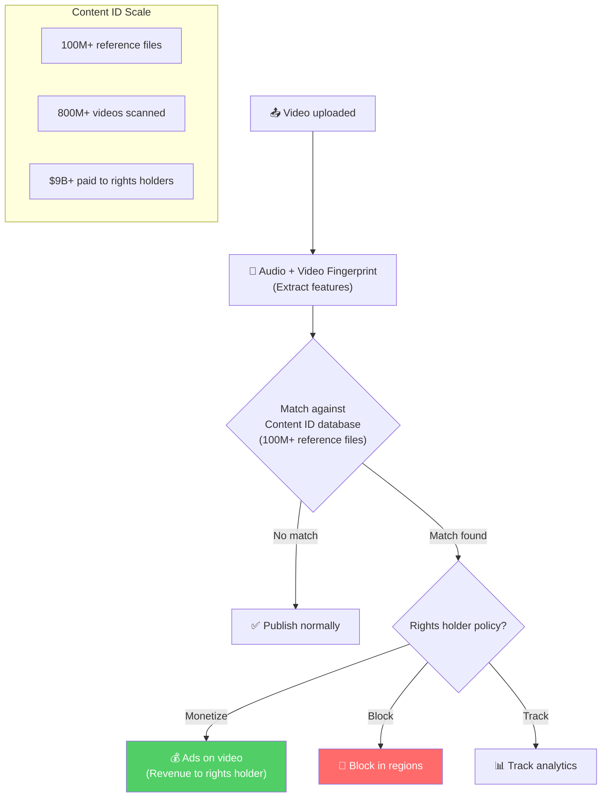
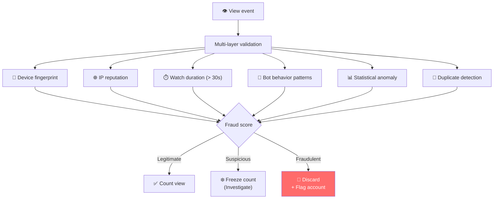
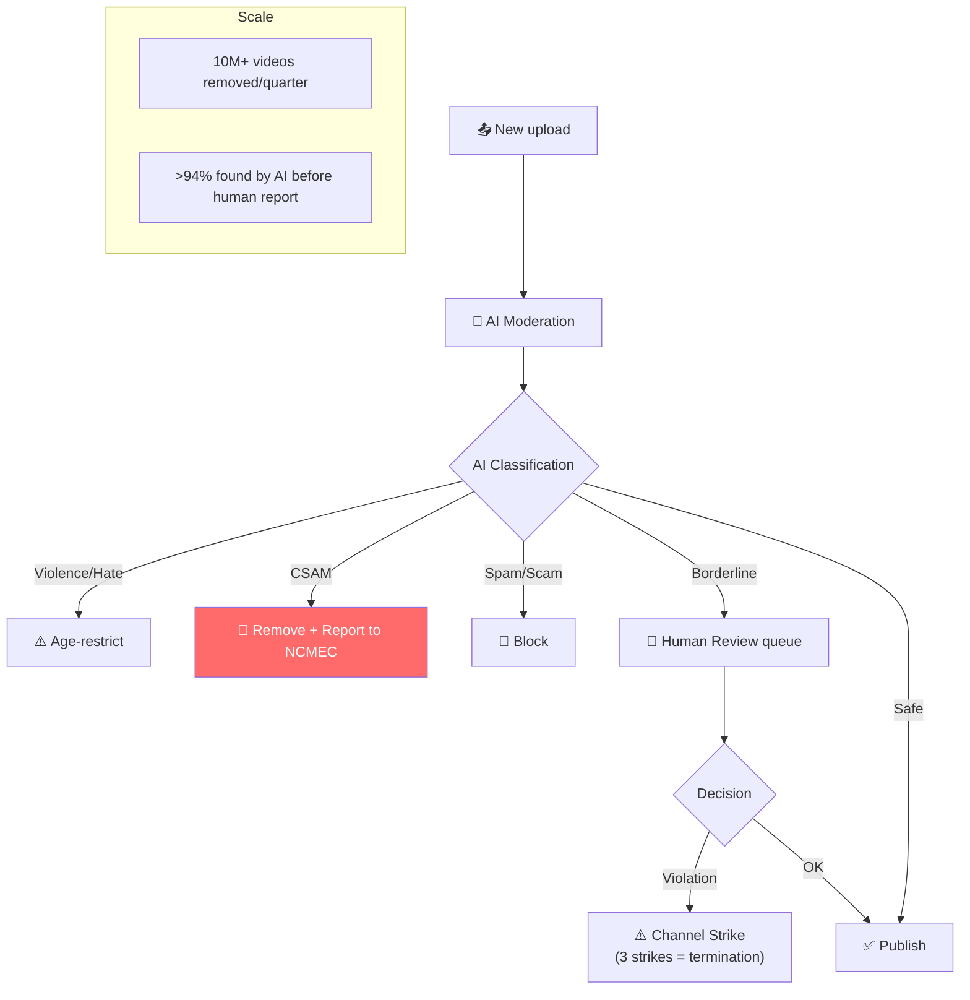

# YouTube - Security Analysis

> YouTube bảo vệ 800M+ videos, creator earnings, và 2.5B+ user accounts.

---

## Tổng Quan

---

## 1. Content ID — Copyright Protection

**Content ID** scan mỗi video upload → so sánh với 100M+ audio/video fingerprints → tự động áp dụng policy.

---

## 2. View Fraud Detection

**Why critical:** View counts directly determine **creator revenue** (ad revenue sharing). Fake views = fake money.

---

## 3. Content Moderation Pipeline

---

## 4. API Security

| Measure | Implementation |
|---|---|
| **API Keys** | Per-project keys, quotas per key |
| **OAuth 2.0** | Standard Google OAuth for user data |
| **Rate Limiting** | Quota units per day (10,000 default) |
| **Abuse detection** | Anomalous API usage → throttle/ban |
| **Scopes** | Granular (read, upload, manage, etc.) |

---

## 5. So Sánh Security: YouTube vs Others

| Layer | YouTube | Netflix | Instagram | Twitter |
|---|---|---|---|---|
| **Focus** | Copyright + creator revenue | Content piracy (DRM) | Account security | API/bot abuse |
| **Content protection** | Content ID (fingerprint) | DRM + watermark | AI moderation | Community Notes |
| **View integrity** | Multi-layer fraud detection | N/A (subscription) | N/A | N/A |
| **Unique** | $9B+ paid to rights holders | Forensic watermark | ML login risk | FIDO2 key |
| **Auth** | Google Account | Custom OAuth | Meta OAuth | X OAuth |
| **Cloud** | Google Cloud | AWS | Meta DCs | Google Cloud |

---

## Mapping → NestJS

| Pattern | YouTube | NestJS Implementation |
|---|---|---|
| **Content ID** | Audio/video fingerprint | `chromaprint` + custom DB matching |
| **View fraud** | Multi-signal validation | Redis rate counter + ML scoring service |
| **Content moderation** | AI pipeline | Google Vision API / AWS Rekognition |
| **API quotas** | Per-key daily limits | `@nestjs/throttler` + Redis per-API-key |
| **Strike system** | 3-strike channel policy | Database counter + automated enforcement |
