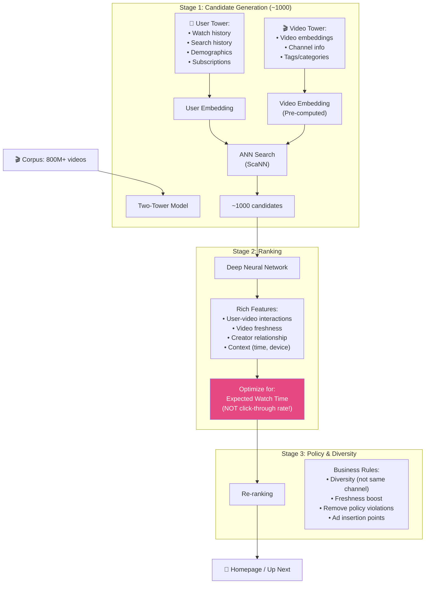
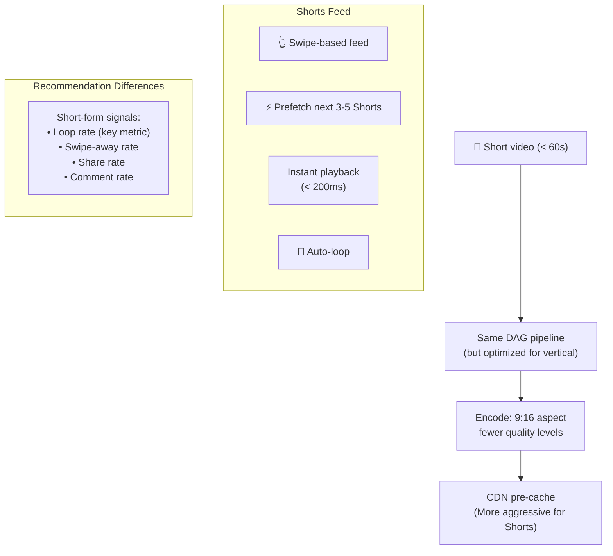
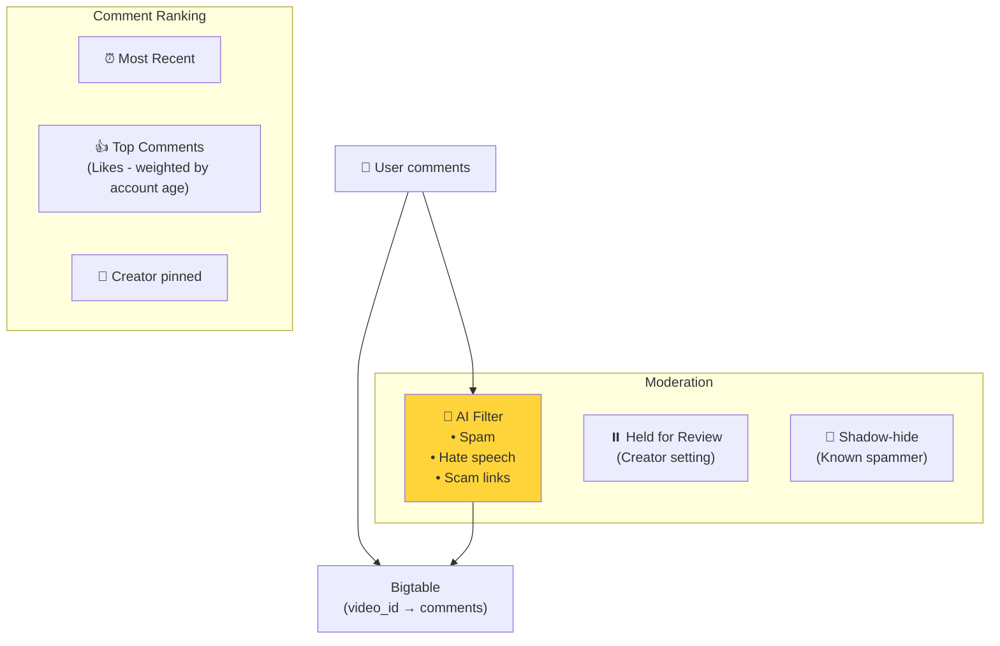
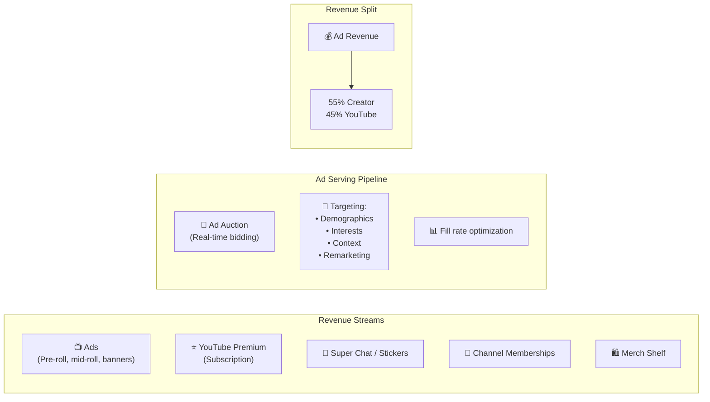
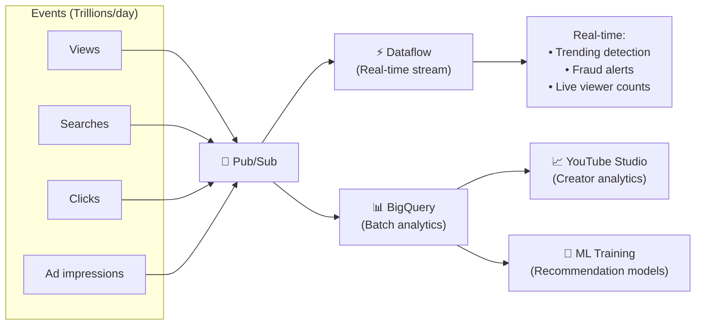

# YouTube - Subsystems Analysis

> Recommendation, Search, Comments, Shorts, Monetization, Reliability.

---

## 1. Recommendation Engine

### Watch Time vs CTR — Key Decision

| Metric | Problem |
|---|---|
| **Click-Through Rate** | Optimizes for clickbait → user dissatisfaction |
| **Watch Time** | Optimizes for engaging content → user retention ✅ |

**YouTube's insight:** Shift from CTR to Watch Time dramatically reduced clickbait and improved user satisfaction.

---

## 2. YouTube Shorts Architecture

---

## 3. Comments System

---

## 4. Monetization Architecture

---

## 5. Data Pipeline & Analytics

---

## 6. So Sánh Tổng Hợp: 5 Systems

| Dimension | YouTube | Netflix | Instagram | Twitter | WhatsApp |
|---|---|---|---|---|---|
| **Primary** | Video UGC | Video licensed | Photo social | Microblog | Messaging |
| **Language** | Python/C++/Java/Go | Java (Spring) | Python (Django) | Scala/Java | Erlang |
| **Database** | Vitess+Bigtable+Spanner | Cassandra+Aurora | PostgreSQL | Manhattan | Mnesia+MySQL |
| **CDN** | Google Edge | Open Connect | Meta CDN | Generic | N/A |
| **Search** | Custom + Elasticsearch | Elasticsearch | Unicorn | Earlybird | N/A |
| **Recommendation** | Two-Tower + Watch Time | Ensemble + everything | Two-Tower + engagement | Trending + ranking | N/A |
| **Content protection** | Content ID | DRM | AI moderation | Community Notes | E2EE |
| **Open source** | Vitess, VP9, AV1 | Netflix OSS | Less public | Zipkin, Finagle | Less public |

---

## YouTube Unique Innovations

| Innovation | Impact |
|---|---|
| **Vitess** | MySQL sharding at scale → now CNCF project (PlanetScale, Slack use it) |
| **VP9 / AV1** | Open video codecs → saved billions in bandwidth globally |
| **Content ID** | Automated copyright → $9B+ paid to rights holders |
| **Watch Time optimization** | Shifted industry from CTR to engagement metrics |
| **QUIC** | Created by Google → now HTTP/3 standard (RFC 9000) |
| **YouTube Shorts** | TikTok competitor → 70B+ daily views |

---

## Mapping → NestJS

| Subsystem | YouTube | NestJS Implementation |
|---|---|---|
| **Recommendation** | Two-Tower + TensorFlow | TensorFlow.js / Python via gRPC |
| **Shorts feed** | Prefetch + swipe | `@nestjs/websockets` + preload queue |
| **Comments** | Bigtable (video_id partitioned) | MongoDB / Cassandra (partitioned by video) |
| **Monetization** | Real-time ad auction | External ad network SDK |
| **Analytics** | Pub/Sub → BigQuery | Kafka → ClickHouse + Grafana |
| **Creator Studio** | BigQuery dashboards | Custom dashboard + ClickHouse queries |
